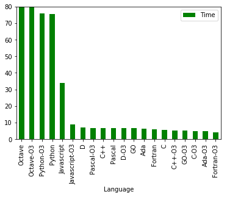
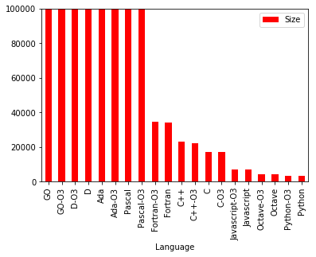
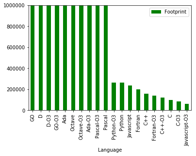
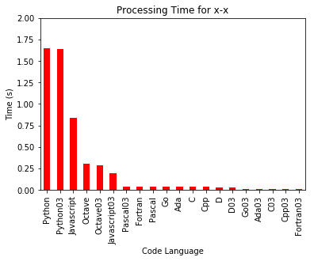

# 01benchmark
This is a benchmark of programming language compilers.
## #Introduction
I wrote these codes for myself to determine which programming language generates the fastest code to do elemntary math calculations.  In this process I found out that even if that particular compiler generates the fastest code, it does not mean that its all math functions are fast.  This means that other compilers have some good algorithm to do math calculations fast. To bench compilers on equal footing, I selected free compilers that are mostly not supported at the corporate level.  Furthermore I wrote down simple codes mainly focusing on benchmarking the math functions only.  I also paid attention to number of code lines and type of code used.  It is not perfect but definately a good try.  After completing this code and seeing the results, I am satisfied with the conclusion it brings and therefore I condisder this my little project - a case closed.  I am sharing this code hoping that one may find it useful.  It is free to to use.
### OS and Compilers
You will see list of codes for some of programming language I was interested in (10).  The languages are: Ada, C, C++, D, Fortran, Go, Javascript, Gnu Octave, Pascal, and Python. One can notice that Python, Octave and Javascript are script languages.  I included them to see how they compare with programming language.  
The codes are written for linux system (opensuse 15.2 Leap). 
### How to run it.
You have to ensure that you have linux system, the compilers (see make) and time (about 40 minutes mainly for octave). Then go to the directory were these files are located in your hardrive and type make.   Once the make is completed, use jupyter notebook to run benchReport1.ipynb.  It will summarize all the timings to execute each programming language code, their individual math functions, code size and not really accurate info but useful: code's footprint (or carbon footprint - Time to execute times code size). The results are listed in tables and in bar graphs. 
### Summary of my results
On my system, the programming language that generates the fastest code to do the math is Fortran 03 (optimized). To my surprise the next one is Ada 03.  Then in following order are C 03, Go 03, C++ 03, C, Fortran, Ada, Go, D 03, Pascal, C++, Pascal 03, D, Javascript 03, Javascript, Python, Python 03, Octave 03, Octave.  One may think that all math functions processing time is consistent with overall processing time.  This is not the case.  For example, some math functions in Octave (that can be vectorized) can beat even C compiler and yet the GNU Octave is overall slower than C.  Those who maintain compiler of particular programming language can find these examples as a good reference of his/her algorithm performance.  The is not a programming language comparison or compiler evaluation etc. It is just a test run for math calculation speed to determine which compiler do math fast.   
### Screenshot
This is a screenshot of benchReport1.ipynb graphical summary of results.

